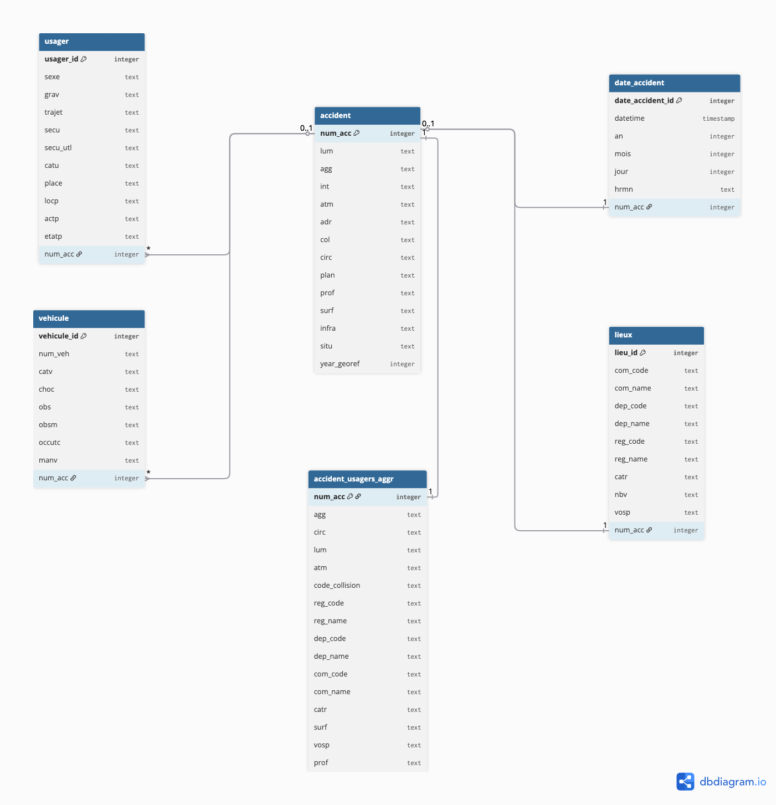

<h2 align="center">Projet-1-Simplon-Data-Engineer-2025---Mighty-Mosquitoes

<h1 align="center">ETL et Analyse de Données : Accidents corporels de la circulation Millésimé</h2>

## 🚗 Introduction du projet

En tant que **Data Engineer** au sein d’un **observatoire régional de la sécurité routière**.  
Votre mission consiste à **concevoir une base de données centralisée** pour stocker et analyser les **données d’accidents corporels de la circulation en France**, issues de la plateforme publique **Opendatasoft**.

L’objectif principal est de **mettre en place une chaîne complète de data engineering**, depuis la **récupération des données (API ou CSV)** jusqu’à leur **modélisation et analyse dans une base PostgreSQL**.

➡️ **Ingestion → Transformation → Modélisation → Stockage → Analyse SQL**

## 🎯 Objectifs métier

L’équipe métier souhaite pouvoir :

- Identifier les **zones à risque** et les types d’accidents les plus fréquents  
- Étudier les **conditions de survenue** : météo, luminosité, type de route, heure, etc.  
- Analyser les **tendances temporelles** et saisonnières  
- Faciliter la **visualisation des indicateurs** via des tableaux de bord

## 🛣️ Source des données

Les données proviennent du portail public :  
🔗 **[Opendatasoft – Accidents corporels de la circulation (millésime)](https://public.opendatasoft.com/explore/assets/accidents-corporels-de-la-circulation-millesime/)**

Elles peuvent être exploitées via :

- **l’API Opendatasoft**, permettant une mise à jour automatisée des données  
- ou **le téléchargement de fichiers CSV**, pour un chargement local  

Ces jeux de données comprennent des informations sur :

- les **accidents** (numéro, gravité, date, heure, localisation)  
- les **usagers** impliqués (âge, sexe, rôle)  
- les **véhicules** concernés (catégorie, caractéristiques)  
- les **conditions** de survenue (météo, luminosité, type de route, etc.)

## 🛠️ Architecture technique et environnement de développement

- **Python** : ingestion, nettoyage et transformation des données  
- **Pandas** : manipulation des fichiers CSV et préparation des datasets  
- **PostgreSQL** : stockage relationnel, modélisation des données et intégration fluide avec l’écosystème Python  
- **SQL** : requêtes analytiques et création de tableaux de bord  
- **SQLAlchemy** : couche d’abstraction entre Python et PostgreSQL, facilitant les échanges et la persistance des données  

Nous avons choisi **PostgreSQL** comme SGBDR car il offre un excellent compromis entre performance, robustesse et flexibilité.  
Il s’intègre naturellement avec **Python** via **SQLAlchemy** et les bibliothèques de data science, ce qui permet de gérer efficacement des données massives issues d’API JSON (jusqu’à 500 000 enregistrements dans ce projet), tout en garantissant l’intégrité relationnelle (accidents, véhicules, personnes).


## 🧱 Architecture et conception du modèle de données

Le modèle relationnel comprend plusieurs entités principales :



- **Accidents** : informations sur l’accident (date, heure, gravité, localisation)  
- **Usagers** : personnes impliquées (âge, sexe, rôle dans l’accident)  
- **Véhicules** : type, catégorie et caractéristiques des véhicules impliqués  
- **Lieux** : géolocalisation et type de route  
- **Conditions** : météo, luminosité et autres facteurs environnementaux  

Chaque table est reliée par des **clés primaires et étrangères** pour garantir l’intégrité et faciliter l’analyse.

## 🧩 Prérequis

### 1️⃣ Installer PostgreSQL

Téléchargez et installez PostgreSQL depuis le site officiel :  
👉 [https://www.postgresql.org/download/](https://www.postgresql.org/download/)

---

### 2️⃣ Gestion des dépendances avec la librairie **uv**

#### A. Installation de `uv`

Dans votre terminal, exécutez :

```bash
pip install uv
```

#### B. Initialiser un nouveau projet

Si vous démarrez un nouveau projet, exécutez :

```bash
uv init
```

Cela crée deux fichiers à la racine du projet :

- pyproject.toml
- uv.lock

#### C. Synchroniser les dépendances existantes

```bash
uv sync
```

#### D. Ajouter une nouvelle dépendance

```bash
uv add <nom_de_la_dépendance>
```

Exemple:

```bash
uv add sqlalchemy
```

### 3️⃣ Utilisation des fichiers `.env` et `config.yaml`

Pour garantir la sécurité et la portabilité du projet, nous séparons **les informations sensibles** des **paramètres de configuration généraux**.

#### 🔒 Fichier `.env`

- Contient **les informations sensibles** : mots de passe, identifiants de base de données, clés d’API, etc.  
- **Ne doit pas être versionné** (inclus dans `.gitignore`).

Exemple de contenu pour PostgreSQL :

```
POSTGRES_USER=postgres
POSTGRES_PASSWORD=secret123
POSTGRES_HOST=localhost
POSTGRES_PORT=5432
POSTGRES_DB=ma_base
```

⚙️ Fichier `config.yaml`

- Contient les paramètres non sensibles et communs au projet : noms de tables, chemins, options de nettoyage, etc.
- Peut être versionné, car il ne contient pas de secrets.
- Peut utiliser les variables définies dans .env pour les informations sensibles.

Exemple de configuration :

```
database:
  user: ${POSTGRES_USER}
  password: ${POSTGRES_PASSWORD}
  host: ${POSTGRES_HOST}
  port: ${POSTGRES_PORT}
  db_default: ${POSTGRES_DB}

  db_accm: "db_accm" # BDD accident corporel circulation millésimé

sqlfile:
  file_1: "test_req.sql"
```

Cette séparation garantit un projet sécurisé, portable et facile à maintenir.
